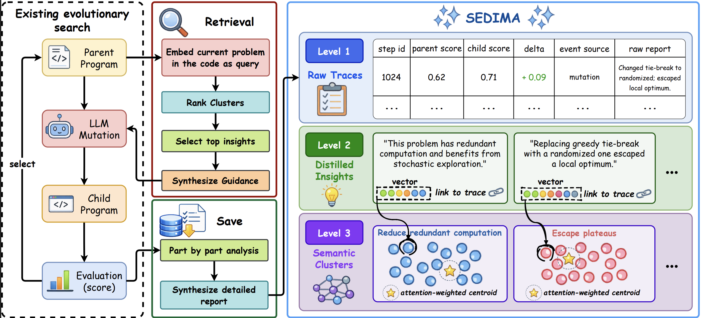

# SEDIMA

<div align="center">



**Cross-Run Hierarchical Insight Memory for Evolutionary Search Agents**

</div>

---

## Overview

LLM-driven evolutionary search agents (e.g. [OpenEvolve](https://github.com/algorithmicsuperintelligence/openevolve), [ShinkaEvolve](https://github.com/SakanaAI/ShinkaEvolve)) repeatedly propose, evaluate, and refine candidate programs — but every run starts from scratch. Reasoning about *why* an edit helped or hurt is discarded the moment a run ends, so an agent applied to a new problem re-derives modifications it has already discovered and re-explores directions that were previously neutral or useless.

**SEDIMA** is a persistent, hierarchical insight memory that attaches to an evolutionary search loop at exactly two points — a **write** after each evaluation and a **read** before each mutation — and leaves selection, population management, and mutation operators unchanged. Raw evolution traces are distilled into natural-language insights, organized into semantic clusters using **attention-weighted centroids**, and retrieved by semantic similarity to condition future mutations. Because memory is persisted on disk and retrieved by content rather than genealogical lineage, experience accumulates **across runs and problems**, not just within a single trajectory.

This repository implements SEDIMA as a drop-in memory module on top of [OpenEvolve](https://github.com/algorithmicsuperintelligence/openevolve). The search loop, LLM ensemble, MAP-Elites database, and evaluation pipeline are unmodified; the memory hooks live in [`openevolve/insight_memory.py`](openevolve/insight_memory.py), [`openevolve/embedding.py`](openevolve/embedding.py), and [`openevolve/evolution_trace.py`](openevolve/evolution_trace.py).

### The three-level memory hierarchy

- **Level 1 — Raw traces**: step index, parent/child fitness, fitness delta, event source, and the raw evaluation report for every evaluated candidate.
- **Level 2 — Distilled insights**: an LLM converts each trace into a compact natural-language insight (problem-level for the first evaluation, change-level for each subsequent parent–child pair), embedded and linked back to its Level 1 evidence.
- **Level 3 — Semantic clusters**: Level 2 insights are grouped by embedding similarity; a new insight joins the nearest cluster if its cosine similarity exceeds a threshold, otherwise it seeds a new cluster. Cluster representatives are **attention-weighted centroids** that up-weight prototypical, high-value insights instead of a plain mean.

At mutation time, SEDIMA embeds a query describing the current program and its observed issues, retrieves the top-$K_c$ clusters and top-$K_i$ insights per cluster above a similarity threshold, and synthesizes them into concrete recommendations injected into the mutation prompt. If no cluster clears the threshold, the module falls back to the original prompt, so it degrades gracefully on a cold (empty) memory.

## Results

Averaged across five backbones (GPT-5.4, DeepSeek V4 Pro, Gemini 3 Pro, Qwen 3.7 Max, Qwen 3 Coder) and two harnesses (OpenEvolve, ShinkaEvolve), under a fixed budget of 100 evaluated candidates:

- **+5.5%** average final performance on AlgoTune (harmonic mean speedup)
- **+6.6%** average final performance on ALE-Bench LITE
- **32.3% fewer iterations** needed to reach baseline-best performance under OpenEvolve

See the paper for the full experimental setup, ablations (attention-weighted vs. mean centroids, clustering vs. no clustering, random vs. semantic retrieval), and cross-benchmark transfer analysis.

## Installation

Requires Python 3.10+.

```bash
git clone <this-repo>
cd SEDIMA
pip install -e .
```

Or with Docker:

```bash
docker build -t sedima .
docker run --rm -v $(pwd):/app sedima my_program.py my_evaluator.py --config my_config.yaml
```

> **Note**: the installable package and importable Python module are still named `openevolve` (this project builds directly on the OpenEvolve codebase); the insight memory feature described above is what makes it SEDIMA.

## Quick Start

Set your LLM API key (any OpenAI-compatible endpoint works):

```bash
export OPENAI_API_KEY="your-api-key"
```

Run evolution on your own program and evaluator:

```bash
python openevolve-run.py my_program.py my_evaluator.py \
  --config configs/default_config.yaml \
  --iterations 100
```

Or use the library API directly:

```python
from openevolve import run_evolution

result = run_evolution(
    initial_program="path/to/initial_program.py",
    evaluator="path/to/evaluator.py",
    config="configs/default_config.yaml",
    iterations=100,
)
print(result.best_score, result.best_code)
```

## Enabling the Insight Memory

The memory is configured under the `insight_memory` key of a config YAML (see [`configs/default_config.yaml`](configs/default_config.yaml) for the full, documented set of options):

```yaml
insight_memory:
  enabled: true
  memory_name: "insight_memory"
  storage_path: null                      # null => ~/.openevolve/chroma/<memory_name>
  embedding_model: "Qwen-embedding-4B"
  clustering_similarity_threshold: 0.8     # tau_cluster
  cluster_representation_mode: "attention_weighted"
  cluster_attention_temperature: 0.1       # tau
  retrieval_top_clusters: 3                # K_c
  retrieval_top_members_per_cluster: 3     # K_i
  include_stage1_evidence_in_retrieval: true
```

Because `storage_path` persists to disk by default, the memory built during one run (or one problem) is automatically available to later runs — this is what lets SEDIMA transfer experience across problems and benchmarks. Point `storage_path` at a shared location and reuse the same `memory_name` across runs to accumulate memory intentionally, or use a fresh path/name to evaluate with a cold memory.

## Repository Structure

```
openevolve/            # Core library (search loop, LLM ensemble, database, insight memory)
  insight_memory.py     # Three-level memory: raw traces, distilled insights, semantic clusters
  embedding.py           # Embedding client used for insight/query embeddings
  evolution_trace.py     # Optional detailed evolution trace logging
configs/                # Example configuration files (default, island-based, early stopping)
scripts/                # Evolution visualizer
openevolve-run.py       # CLI entry point
```

## Citation

If you use SEDIMA in your research, please cite:

```bibtex
@inproceedings{
abaskohi2026sedima,
title={{SEDIMA}: Cross-Run Hierarchical Insight Memory for Evolutionary Search Agents},
author={Amirhossein Abaskohi and Mahdi Mostajabdaveh and Zirui Zhou},
booktitle={Second Workshop for Research on Agent Language Models},
year={2026},
url={https://openreview.net/forum?id=6hbm4tnWBl}
}
```

## Acknowledgments

SEDIMA is built on top of [OpenEvolve](https://github.com/algorithmicsuperintelligence/openevolve), an open-source implementation of AlphaEvolve. The embedding client and novelty-judging prompts are adapted from [ShinkaEvolve](https://github.com/SakanaAI/ShinkaEvolve).

## License

Apache License 2.0. See [LICENSE](LICENSE) for details.
